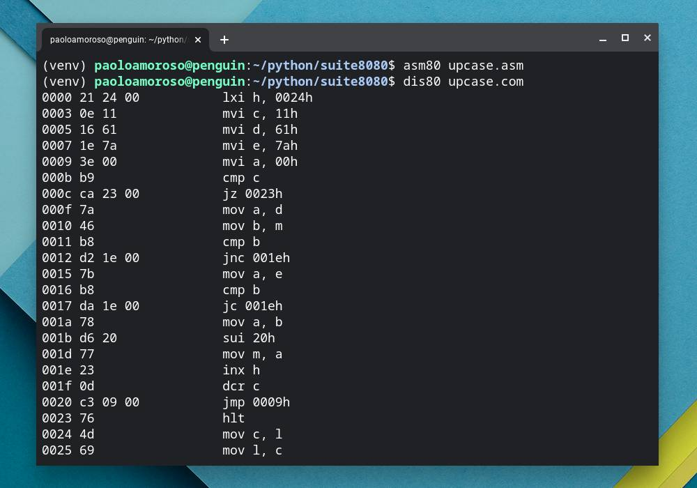

# About Suite8080

[Suite8080](https://github.com/pamoroso/suite8080) is a suite of Intel 8080 Assembly cross-development tools written in Python.

The suite comprises the following command-line programs and more will come:

* `asm80`: assembler
* `dis80`: disassembler

This project is inspired by [a series of blog posts](https://briancallahan.net/blog/20210407.html) by Brian Robert Callahan on demystifying programs that create programs. In an ongoing series of posts on my own blog I'm telling about [my work on and experience with developing Suite8080](https://blog.paoloamoroso.com/search/label/Suite8080).

The executable files generated and processed by the tools are supposed to run on any Intel 8080 system such as CP/M computers, both actual devices and emulated ones.

Suite8080, which is developed with [Replit](https://replit.com), requires Python 3.6 or later and depends on Pytest for unit tests.

## Documentation and sample programs

For information on how to use Suite8080 and its design see the [documentation](https://suite8080.readthedocs.io).

The [`asm`](https://github.com/pamoroso/suite8080/tree/master/asm) directory of the source tree contains sample Assembly programs, some of which run on CP/M and others on a bare Intel 8080 system with no host environment. You can use the Suite8080 tools to process these programs, for example assemble the sources with `asm80` and disassemble the executables with `dis80`.

## Status

Suite8080 is in early development and some of the planned tools and features are not available yet.

## Release history

See the [list of releases](https://github.com/pamoroso/suite8080/releases) for notes on the changes in each version.

## Author

[Paolo Amoroso](https://www.paoloamoroso.com/) developed Suite8080. Email: `info@paoloamoroso.com`

## License

This code is distributed under the MIT license, see the `LICENSE` file.
